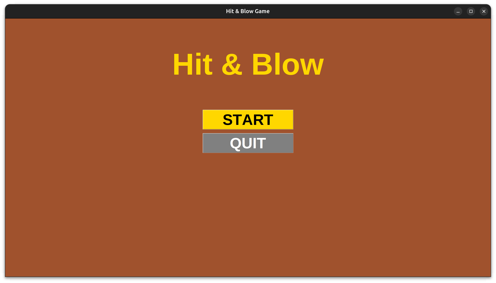
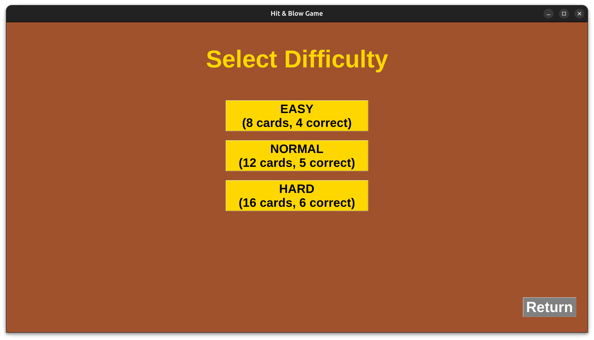
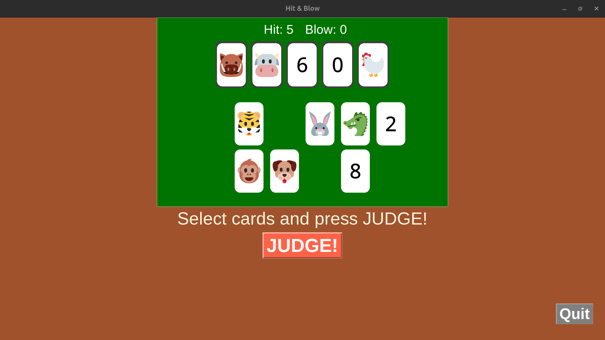
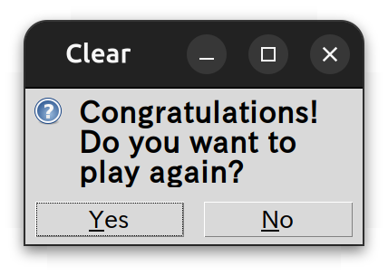

# Hit and Blow Game Manual

## Game Overview
Hit and Blow is a card-based guessing game implemented using only Python's standard library. Players must deduce the correct sequence of cards by making guesses and receiving feedback on hits (correct position and card) and blows (correct card but wrong position).

**Objective:** Guess the hidden correct cards in the fewest attempts.

**Developed with:** Python 3.14.0 (standard library only, no external dependencies).

## Rules
- **Cards:** 0-9 digits and 12 zodiac signs (mouse, cow, tiger, rabbit, dragon, snake, horse, ram, monkey, rooster, dog, boar).
- **Hit:** Correct card in the correct position.
- **Blow:** Correct card but in the wrong position.
- **Win Condition:** All cards are hits (e.g., 4 hits for 4-card mode).

## Difficulty Levels
- Select number of hand cards (total cards dealt).
- Select number of correct cards (sequence length to guess).
- Example: 8 cards, 4 correct → Guess 4-card sequence from 8 cards.

## How to Play
1. **Start:** Click "START" to begin.
   

2. **Select Difficulty:** Choose number of cards and correct sequence length.
   

3. **Guess:** Select cards and click "JUDGE!" to submit guess. Receive hit/blow feedback.
   

4. **Win:** Achieve all hits.
   

5. **Replay:** Choose to play again or exit.
   

## Controls
- **Mouse:** Click cards to select/deselect.
- **Button:** "JUDGE!" to submit guess.
- **Back:** Return to previous screen.

## Tips
- Use hit/blow feedback to narrow down possibilities.
- Track attempts in the history (not shown in screenshots).

## System Requirements
- Python 3.14.0
- Tkinter (standard library)
- Runs on Windows/Linux/Mac (tested on Windows 11).

Developed by: [Team Name]  
For: Information Technology I b Final Assignment</content>
<parameter name="filePath">/home/yorry/devs/25224/HitandBlow/Game_manual.md
